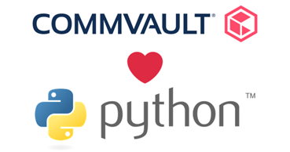
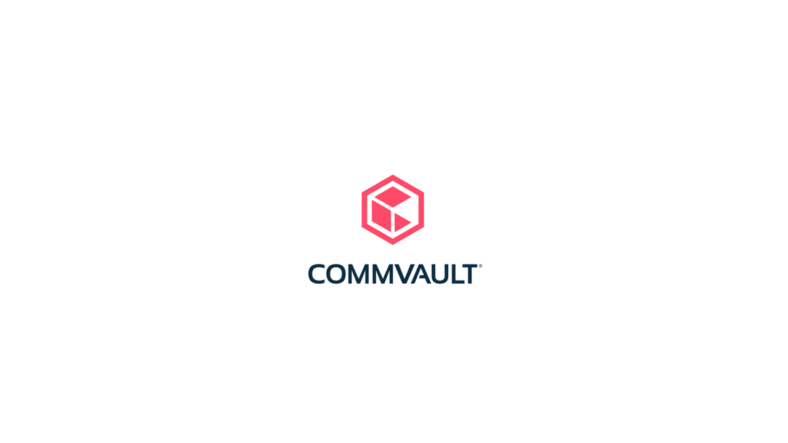
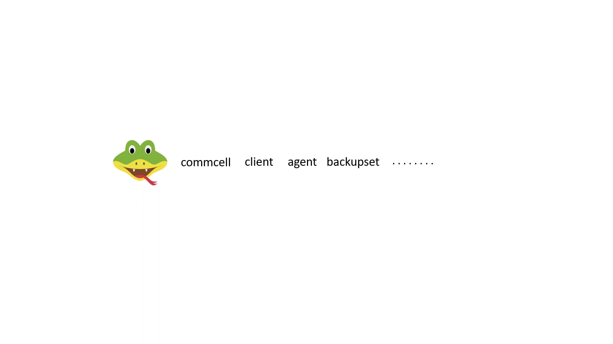

## Do It Yourself with Commvault Python SDK

The Commvault Python Software Development Kit (CVPySDK) is a handy and easy-to-use package with which you can interact with your CommCell and perform all supported operations using Python.



Everybody loves Python for its simplicity and so does Commvault. The CVPySDK presents to you the CommCell in the form of Python objects and modules.

The CVPySDK is a tiny package but has got numerous ways of application and usage. A few lines of Python code can achieve mammoth tasks.

If there’s any kind of automation that you need to perform then CVPySDK is the best suited tool. From simple to complex, all bulk operations on the CommCell can be automated using the CVPySDK to eliminate manual involvement.
Customize the usability and experience of the CommCell from all dimensions. Tune things to your standard and do it yourself. If you’re the wizard, then the CVPySDK is the wand and Commvault is the charm!
Perform internal validation and obtain statistics of your CommCell performance.
Just six lines of Python code and you’ll have a backup job running!

The CVPySDK is so self explanatory that even if you are a beginner in Python, you’ll be able to understand the functioning with ease and kick-start your entry into Python programming.



### Open source

The SDK is open source and the code is publicly available on [GitHub](https://github.com/Commvault/cvpysdk). It is frequently updated with support for any and every new feature introduced by Commvault. We even welcome contributions for the enhancement of the CVPySDK. Once you get used to the SDK, you can even start [contributing to the repository](https://github.com/Commvault/cvpysdk#contribution-guidelines).


### Cross platform

The prerequisites for using the SDK are also very minimal and that’s why you can use it across all platforms. All you need is a command line interface with Python installed.

All communication between the CvPySDK and the Commserver is performed via HTTP(S) calls using [Commvault’s REST APIs](https://documentation.commvault.com/11.24/essential/45540_rest_api_overview.html) which makes the usage safe, secure and convenient.

The [commcell entities](https://documentation.commvault.com/commvault/v11/article?p=1614.htm) are made available in the form of Python modules with which you can create objects and perform all supported operations on them. This would also include installation of agents, configuration and triggering backups. A quick look at our [documentation for the SDK](https://documentation.commvault.com/commvault/v11/article?p=45526_1.htm) and you’ll be good to go ahead.



### Get your hands dirty

Just as you would in the Command Center, you’ll have to first login to your Commcell to perform any operations. To do this we first import the Commcell class, login and initialize the object on the Python interpreter.
```markdown
>>> from cvpysdk.commcell import Commcell
>>> commcell_obj = Comcell(‘host_name’,‘username’,‘**’)
```

On logging in, the commcell_obj would have various entities initiated in the form of instances, you can use the get() method to retrieve any object. Here’s an example of retrieving an instance of your subclient object from the commcell.
```markdown
>>> client_obj = commcell_obj.clients.get(‘client_name’)
>>> agent_obj = client_obj.agents.get(‘file system’)
>>> backupset_obj = agent_obj.backupsets.get(‘backupset_name’)
>>> subclient_obj = backupset_obj.subclients.get(‘subclient_name’)
```

Once you have the entity object, you can perform various operations on the object by invoking the object’s methods or setting their properties. A few examples to modify your subclient name, set a plan to it, trigger a backup job and get the job’s details as a job object.
```markdown
>>> subclient_obj. display_name = ‘new_subclient_name’
>>> subclient_obj.plan = ‘Server Plan 1’
>>> job_obj = subclient_obj.backup()
```

Stuck somewhere? Unable to figure out what operations are in store or what to do next? You can always use the help() method and an object with which you need help. You’ll then be provided with a detailed documentation about each of the functions and attributes in the object.
```markdown
>>> help(job_obj)
```
### We always love to hear from you!

This was just the beginning, there are loads of other such usages in store. You’ll surely learn them once you get started with the SDK.

Our team is always at work to improve your experience and keen on knowing how we can make it even better. Do share your experience with CVPySDK in the comments section. Feel free to reach out to me directly at aprabhu@commvault.com for your opinions and feedback.

Be data ready and keep your scripts steady!
